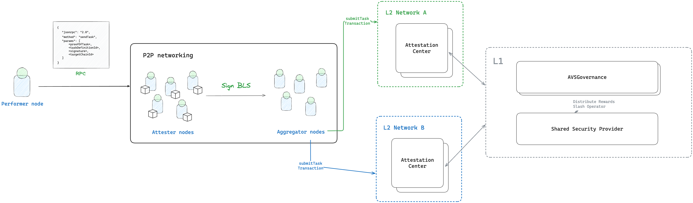

# 🧮 Simple Price Oracle Multi-L2 AVS

This AVS example demonstrates how to deploy and run a price oracle across multiple L2 chains using the Othentic CLI with Multi-L2 support.



## 🚀 Prerequisites

### 1. Othentic CLI Version

Ensure you're using `othentic-cli` version **v1.10.0 or above**, which includes support for Multi-L2 deployments.

```bash
othentic-cli --version
# Should output: v1.10.0 or later
```


## ⚙️ Usage

### 1. Deploy AVS Contracts on Multi-L2
Use the [quick start](https://docs.othentic.xyz/main/avs-framework/quick-start) guide to set up your AVS. When deploying, include all L2 chain names as per the [Supported chains](https://docs.othentic.xyz/main/avs-framework/supported-networks).

In the example below, we deploy to `amoy` and `base-Sepolia`:

```bash
othentic-cli network deploy \
  --l1-chain holesky \
  --l2-chain amoy,base-sepolia \
  --rewards-token 0x94373a4919B3240D86eA41593D5eBa789FEF3848 \
  --l1-initial-deposit 1000000000000000000 \
  --l2-initial-deposit 2000000000000000000 \
  --name test-avs-name
```

### 2. Configure the .env File

Refer to `.env.example` and ensure the following variables are set correctly:

```bash
L2_CHAIN=80002,84532
L2_RPC=80002@https://rpc.ankr.com/polygon_amoy/,84532@https://rpc.ankr.com/base_sepolia/
ATTESTATION_CENTER_ADDRESS=80002@0x968aA85F556ECf9164D7Dfb00a3b404b4eD6dEc0,84532@0x5F2b17764986Da7Fa0a8E96f81B3C8244116aB3F
```


### 3. Update Docker Compose
Open your `docker-compose.yml` file and update the flags `--l1-chain` and `--l2-chain`

Ensure these values match the chain names you deployed on.

### 4. Run the Docker Containers & Trigger Task Execution

ℹ️ `targetChainId` determines which L2 chain your AVS tasks should be submitted to, by default the task is submitted to the first L2 chain in the environmnet configuration.

```bash
docker-compose up --build
curl -X POST http://localhost:4003/task/execute \
  -H "Content-Type: application/json" \
  -d '{"targetChainId": 84532}'
```
This command will build and run your AVS across the configured L1 and L2 chains.


✅ You're Done!

Your Multi-L2 AVS is now deployed and operational! It will submit tasks to all the configured chains via the TARGET_CHAIN_ID configuration.

For more details, refer to [Othentic Multi-L2 Explainer](https://docs.othentic.xyz/main/avs-framework/explainers/multi-l2s).

